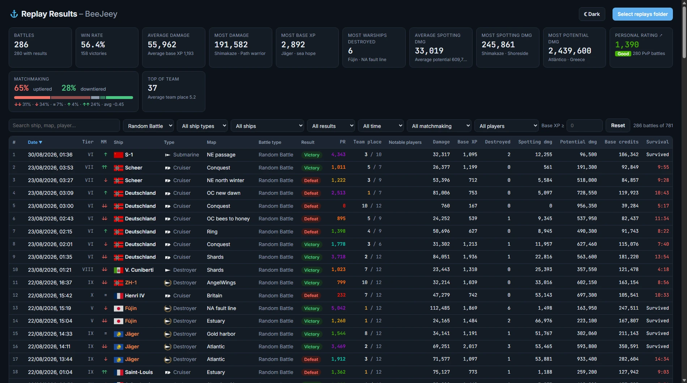

# wows-replay-explorer

A local web app that shows your own stats from your World of Warships replay files.

Point it at your `replays` folder and it lists every battle with the result, damage, XP,
ships destroyed and more – sortable and filterable, so you can find your best games.
Everything runs in your browser. No server, no account, nothing is uploaded.



## Features

- **Battle list** – date, ship, tier, type, map, battle type, result, damage, XP, base XP,
  ships destroyed, spotting damage, potential damage, credits and survival. Click a column
  to sort.
- **Summary cards** – win rate, averages, and your records (most damage, XP, spotting,
  potential damage). The cards follow the active filters.
- **Battle details** – the full scoreboard for both teams, with every player's ship,
  damage, base XP and PR.
- **Personal Rating (PR)** – the WoWS Numbers formula, per battle and overall, for PvP
  battles.
- **Matchmaking** – shows whether you were uptiered (↓, ↓↓), top tier (↑, ↑↑) or in a
  same-tier battle (=), and how often each happens.
- **Team place** – where you finished on your team, ranked by base XP.
- **Ships as in the game** – real names, tiers, nation flags, class icons, and premium /
  special ships marked in gold / orange.
- **Notable players** – highlights clanmates, friendly clans and players you know.
- **Filters** – battle type, ship type, tech tree / premium, result, period, matchmaking,
  notable players, minimum base XP, and free-text search (ship, map, player, clan).
- Light and dark theme.

## Getting started

1. Download or clone this repository.
2. Open `index.html` in a Chromium-based browser (Chrome, Edge, Vivaldi).
3. Click **Select replays folder** and choose your replays folder, for example
   `C:\Games\World_of_Warships\replays`.

The first scan reads every replay (a few thousand files take about a minute). Results are
cached in the browser, so after that only new replays are read – click **Rescan** after
playing.

Replays must be enabled in the game. Battles you left before they ended have no results
and show up as "No data".

> Firefox and Brave work too, but cannot remember the folder between visits.

## Updating the game data

Ship names, tiers, icons and flags come from your game install, and the PR expected values
from WoWS Numbers. Refresh them after a game update (requires Python 3):

```
python update_ships.py "C:\Games\World_of_Warships"
```

This rewrites `ships.js`, `expected.js` and `assets/`.

## Notable players

To highlight your clanmates, friendly clans and players you know, copy
`highlight.example.js` to `highlight.js` and fill in your own names. The file is ignored by
git, so your list stays on your machine.

## Development

The app is a single static page – no framework, no dependencies, no server.

| File | Purpose |
| --- | --- |
| `src/app.html` | The source: markup, styles, replay parser and UI. |
| `build.py` | Produces `index.html` by inlining the Blowfish tables the parser needs. |
| `index.html` | The built page. This is what you open. |
| `update_ships.py` | Extracts ship data, icons and flags from the game, and downloads PR expected values. |
| `ships.js`, `expected.js`, `assets/` | Generated data. |
| `highlight.example.js` | Template for your own `highlight.js` (notable players). |

After editing `src/app.html`:

```
python build.py
```

### How it works

A `.wowsreplay` file is a JSON header followed by a Blowfish-encrypted, zlib-compressed
packet stream. The app decrypts and inflates the stream in the browser (in Web Workers) and
reads the battle results packet at the end. The results are unnamed arrays whose layout
changes between game versions; the parser locates the fields relative to the player's XP.
Tested with game versions 14.6 – 15.8.

## Privacy

Replays are read locally with the browser's file access API. The page makes no network
requests with your data; the only external resource is the web font.

## Credits

- Personal Rating formula and expected values: [WoWS Numbers](https://wows-numbers.com/personal/rating).
- World of Warships, its ship names, icons and flags are the property of Wargaming.net.
  This is an unofficial fan project, not affiliated with or endorsed by Wargaming.
